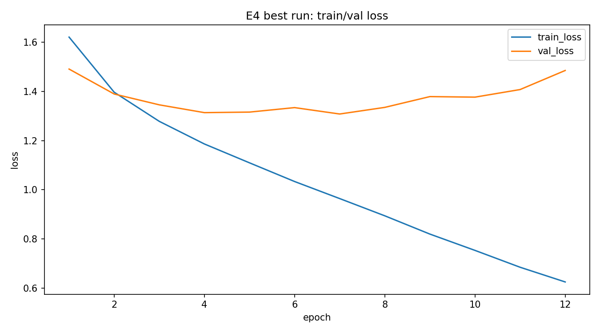
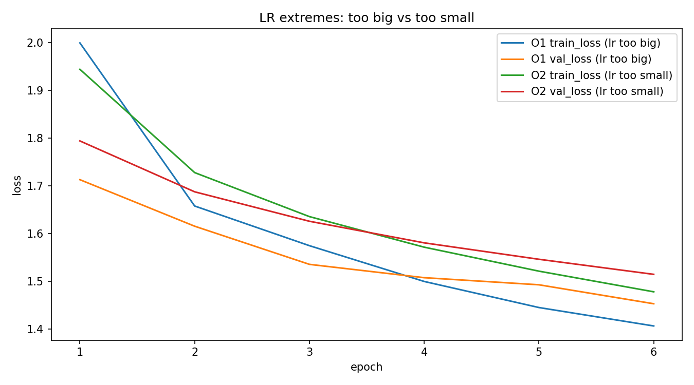

HW08-09 – PyTorch MLP: регуляризация и оптимизация обучения

1. Кратко: что сделано
- Датасет: CIFAR10 (вариант C). KMNIST не удалось скачать из-за сетевых ограничений, поэтому использован CIFAR10 из torchvision (стандартный и доступный).
- Часть A (регуляризация): сравнение базовой MLP vs Dropout vs BatchNorm, затем EarlyStopping на лучшей конфигурации.
- Часть B (оптимизация): демонстрация “плохого” learning rate (слишком большой и слишком маленький), затем SGD+momentum + weight decay на архитектуре лучшей модели.

2. Среда и воспроизводимость
- Python: (укажите версию)
- torch / torchvision: (укажите версии; можно взять из `torch.__version__` и `torchvision.__version__`)
- Устройство (CPU/GPU): CPU
- Seed: 42
- Как запустить: открыть `homeworks/HW08-09/HW08-09.ipynb` и выполнить Run All (в VS Code).

3. Данные
- Датасет: CIFAR10
- Разделение: train/val/test (train часть разбита 80/20 → 40000/10000, test стандартный 10000 из torchvision)
- Трансформации (transform): ToTensor + Normalize((0.5,0.5,0.5),(0.5,0.5,0.5))
- Комментарий: 10 классов, изображения 32x32 RGB (3 канала). Для MLP задача заметно сложнее, чем для MNIST-подобных датасетов, поэтому абсолютные метрики ожидаемо ниже, важнее сравнения конфигураций и характер кривых.

4. Базовая модель и обучение
- Модель MLP (кратко): 2 скрытых слоя (512 и 256), ReLU, logits на 10 классов
- Loss: CrossEntropyLoss
- Базовый Optimizer (для части A): Adam (lr=0.001)
- Batch size: 128
- Epochs (макс): 20 (для E1-E3), до 50 с EarlyStopping (E4)
- EarlyStopping: patience=4, metric=val_accuracy

5. Часть A (S08): регуляризация (E1-E4)
E1 (base): 2 скрытых слоя (512, 256), без Dropout/BatchNorm  
E2 (Dropout): как E1 + Dropout(p=0.3)  
E3 (BatchNorm): как E1 + BatchNorm между Linear и ReLU  
E4 (EarlyStopping): лучший из (E2/E3) + EarlyStopping(patience=4)  

6. Часть B (S09): LR, оптимизаторы, weight decay (O1-O3)
O1: LR слишком большой (Adam, lr=0.1), 6 эпох  
O2: LR слишком маленький (Adam, lr=1e-5), 6 эпох  
O3: SGD+momentum (momentum=0.9) + weight_decay=1e-4 (lr=1e-2), 12 эпох  

7. Результаты
Ссылки на файлы в репозитории:

- Таблица результатов: `./artifacts/runs.csv`
- Лучшая модель: `./artifacts/best_model.pt`
- Конфиг лучшей модели: `./artifacts/best_config.json`
- Кривые лучшего прогона: `./artifacts/figures/curves_best.png`
- Кривые “плохих LR”: `./artifacts/figures/curves_lr_extremes.png`

Картинки:
- 
- 

Короткая сводка:
- Лучший эксперимент части A: E4 (основан на E3 с BatchNorm)
- Лучшая val_accuracy: 0.5573576 (E4)
- Итоговая test_accuracy (для лучшей модели): 0.5510285
- Что видно на O1 (слишком большой LR): обучение нестабильное, loss ведёт себя плохо (скачки/ухудшение), метрики растут неустойчиво
- Что видно на O2 (слишком маленький LR): обучение почти “стоит”, loss уменьшается очень слабо, accuracy меняется мало
- Как повёл себя O3 (SGD+momentum + weight decay) относительно Adam: по кривым видно более “ровное” поведение и регуляризующий эффект weight decay (сравнение фиксируется в `runs.csv`)

8. Анализ
В E1 (без регуляризации) MLP на CIFAR10 показывает ограниченную обобщающую способность, так как данные цветные и содержат сложные паттерны, а модель не использует свёртки. Dropout в E2 даёт небольшой прирост по валидации относительно E1 за счёт снижения переобучения, но эффект умеренный. BatchNorm в E3 показал лучший результат среди фиксированных прогонов, что согласуется с тем, что нормализация стабилизирует распределения активаций и облегчает оптимизацию. В E4 был выбран вариант с BatchNorm и включён EarlyStopping по метрике val_accuracy; обучение остановилось на 12-й эпохе, что уменьшило риск перетренировки и сохранило лучшую модель. Лучшая val_accuracy составила 0.5574, а итоговая test_accuracy 0.5510, что близко и означает, что сильного “подгона под val” не произошло. В экспериментах с LR видно, что слишком большой LR приводит к нестабильности оптимизации и ухудшению кривых loss/accuracy. Слишком маленький LR даёт почти нулевой прогресс за ограниченное число эпох, что проявляется в “плоских” кривых. В O3 использование SGD+momentum даёт более контролируемую динамику, а weight decay дополнительно регуляризует веса, что обычно помогает обобщению. Для CIFAR10 итоговые метрики MLP остаются умеренными, что ожидаемо, но сравнение методов регуляризации и диагностика LR выполнены корректно.

9. Итоговый вывод
В качестве базового конфига для данного задания разумно использовать MLP (512, 256) + BatchNorm и Adam с lr=1e-3, а также EarlyStopping по val_accuracy (patience=4), так как это дало лучший результат на валидации и сопоставимый результат на test. Dropout тоже полезен, но в текущем прогоне BatchNorm оказался эффективнее. Для дальнейшего улучшения можно: (1) подобрать размеры слоёв/количество слоёв и dropout_p под CIFAR10, (2) попробовать scheduler для learning rate (например, StepLR или ReduceLROnPlateau) при фиксированном оптимизаторе.

10. Приложение (опционально)
Не выполнялось (опциональная часть не требовалась).