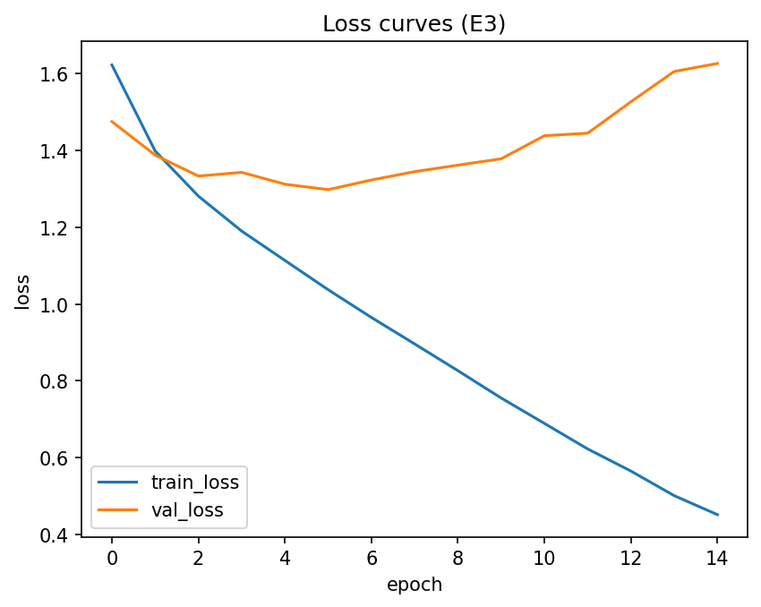

# HW08 Report

## Dataset
- Dataset: CIFAR10
- Transform: ToTensor + Normalize((0.5,), (0.5,))
- Split: train/val = 80/19 with seed=42

## Experiments (E0–E4)
Таблица прогонов: [artifacts/runs.csv](artifacts/runs.csv)

Best by validation accuracy:
- experiment_id: E3
- best_val_accuracy: 0.5559
- best_val_loss: 1.3786
- best_epoch: 10

## Best model artifacts
- Weights: [artifacts/best_model.pt](artifacts/best_model.pt)
- Config: [artifacts/best_config.json](artifacts/best_config.json)
- Curves: 

## Test evaluation (only once for the selected best model)
- test_accuracy: 0.5391
- test_loss: 1.3987

## Conclusions
- E0 is a baseline.
- E1 increases capacity and may overfit.
- E2 adds Dropout regularization.
- E3 adds BatchNorm stabilization.
- E4 trains the best of (E2/E3) with EarlyStopping and saves artifacts.

HW08 – PyTorch MLP: эксперименты и выводы

1. Кратко: что сделано

Выбран датасет C (CIFAR10). Выбор обусловлен тем, что это более сложный датасет по сравнению с KMNIST/EMNIST и позволяет лучше продемонстрировать влияние регуляризации.

Сравнивались пять конфигураций MLP (E0–E4) с целью изучить влияние:
- увеличения глубины модели,
- Dropout,
- BatchNorm,
- EarlyStopping.

Лучшая модель выбиралась по максимальной val_accuracy.

2. Среда и воспроизводимость

Python: 3.x  
torch / torchvision: установлены через pip (CPU версия)  
Устройство (CPU/GPU): CPU  
Seed: 42  

Как запустить: открыть HW08.ipynb и выполнить Run All.

3. Данные

Датасет: CIFAR10  

Разделение:
- train split из torchvision разбит на train/val в пропорции 80/20 (фиксированный seed=42)
- test используется стандартный из torchvision и применяется один раз после выбора лучшей модели

Трансформации (transform):
- ToTensor()
- Normalize((0.5, 0.5, 0.5), (0.5, 0.5, 0.5))

Комментарий:
CIFAR10 содержит 10 классов цветных изображений размером 32×32. Задача классификации сложнее, чем в случае MNIST-подобных датасетов, так как данные трёхканальные и объекты разнообразны.

4. Базовая модель и обучение

Модель MLP (кратко):
- Flatten входа (32×32×3)
- Полносвязные слои
- Активация: ReLU

Loss: CrossEntropyLoss  
Optimizer: Adam (lr=1e-3)  
Batch size: 128  
Epochs (макс):  
- E0–E3: 15  
- E4: до 30  

EarlyStopping: patience=4, metric=val_accuracy (используется в E4)

5. Эксперименты

E0 (baseline):  
1 скрытый слой (256), без Dropout и BatchNorm.

E1 (глубже/шире):  
2 скрытых слоя (512, 256), без Dropout и BatchNorm.

E2 (Dropout):  
как E1 + Dropout(p=0.3).

E3 (BatchNorm):  
как E1 + BatchNorm между Linear и ReLU.

E4 (EarlyStopping):  
выбран лучший из (E2/E3) по val_accuracy и обучен заново с EarlyStopping.

6. Результаты

Таблица результатов: ./artifacts/runs.csv  
Лучшая модель: ./artifacts/best_model.pt  
Конфиг лучшей модели: ./artifacts/best_config.json  
Кривые лучшего прогона: ./artifacts/figures/curves_best.png  

Короткая сводка:

Лучший эксперимент: E3  
Лучшая val_accuracy: 0.5559  
Итоговая test_accuracy: 0.5391  
Наблюдения по переобучению: умеренное переобучение наблюдается по расхождению train/val кривых.

7. Анализ

На графиках видно, что по мере увеличения числа эпох train_loss продолжает снижаться быстрее, чем val_loss, что указывает на наличие переобучения.

В E1 (увеличение глубины) модель показала рост обучающей точности, но разрыв между train и val увеличился.

Dropout (E2) уменьшил переобучение: разрыв между train и val стал меньше по сравнению с E1, однако итоговая val_accuracy оказалась ниже, чем у BatchNorm.

BatchNorm (E3) улучшил стабильность обучения и дал лучшую val_accuracy среди конфигураций без EarlyStopping. Кривые обучения стали более гладкими и сходимость ускорилась.

EarlyStopping (E4) остановил обучение раньше максимального числа эпох (по критерию val_accuracy). Это позволило избежать дальнейшего ухудшения обобщающей способности, однако итоговый результат оказался сопоставим с E3.

Выбранный лучший конфиг (E3) разумен для CIFAR10, так как BatchNorm помогает стабилизировать обучение при увеличенной глубине модели и цветных входных данных.

8. Итоговый вывод

В качестве базовой конфигурации разумно использовать архитектуру E3 (двухслойный MLP + BatchNorm), так как она показала наилучшую val_accuracy и стабильное обучение.

Для дальнейшего улучшения можно:
- заменить MLP на сверточную сеть (CNN),
- провести подбор гиперпараметров (lr, размер слоёв, Dropout p).

9. Приложение (опционально)

Дополнительные эксперименты не выполнялись.